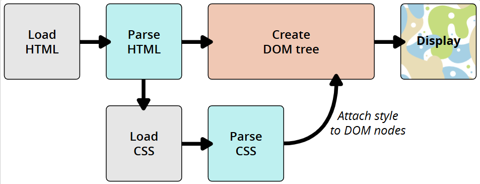
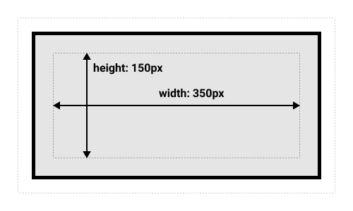

# CSS基础 

#### 什么是CSS 
CSS是一门**样式表语言**，用来指定文档如何展示给用户  

#### 在HTMl中使用CSS
1. 外部样式表
   使用link标签可以引入CSS文件（一般放在\<head>标签块内）
   > \<link href="..." ref="stylesheet">  
   > ref：让浏览器知道加载的是css文件
2. 内部样式表
   使用\<style>标签（一般放在\<head>标签块内），将样式设置在标签块内
   >````html
   > <html>
   >   <head>
   >     <style>
   >       p {
   >         color: red
   >       }
   >     </style>
   >   </head>
   >   <body>
   >     <p>test</p>
   >   </body>
   > </html>
   >````
3. 内联样式
   设置在元素的style属性内，**尽量避免这样使用**，这种方法不符合最佳实践
   > ````html
   > <p style="color: red">test</p>
   > ````

#### CSS如何运行
###### 浏览器如何加载网页
1. 载入HTML文件
2. HTMl转化成DOM树
3. 拉取HTML相关的大部分资源：图片、视频、css样式等，js则会在稍后处理
4. 对CSS进行解析，根据选择器的不同分到不同的“桶”中，将选择器应用在DOM的节点上，添加节点依赖的样式（渲染树）
5. 规则应用于渲染树之后，渲染树按照应该出现的结构进行布局
6. 网页展示在屏幕上（着色）


**当浏览器解析到不支持的CSS的属性或者值的时候，会忽略并且往后解析**  

## 选择器的类型
[选择器类型练习代码](./selectType.html)
| 选择器名称               | 示例                                                                                                                                                            | 说明                                                                                                                      |
| :----------------------- | :-------------------------------------------------------------------------------------------------------------------------------------------------------------- | :------------------------------------------------------------------------------------------------------------------------ |
| 全局选择器               | *                                                                                                                                                               | 选中文档中的所有内容                                                                                                      |
| 元素选择器（标签选择器） | SPAN                                                                                                                                                            | 匹配指定的html元素，大小写不敏感                                                                                          |
| 类选择器                 | .className                                                                                                                                                      | 匹配class属性为“className”的元素                                                                                          |
| ID选择器                 | #idName                                                                                                                                                         | 匹配id属性为“idName”的元素                                                                                                |
| **属性选择器**           |                                                                                                                                                                 | 匹配有特定属性或属性值的选择器                                                                                            |
|                          | span[class]                                                                                                                                                     | 匹配设置了class属性的span元素                                                                                             |
|                          | span[class="className"]                                                                                                                                         | 匹配class属性值为“className”（有且只有这一个类名）的span元素                                                              |
|                          | span[class~="className"]                                                                                                                                        | 匹配class属性至少有一个值为“className”的span元素                                                                          |
|                          | span[class\|="className"]                                                                                                                                       | 匹配class属性有一个名为“className”或者以className开头后面紧跟连字符的元素 **如果该元素class中有多个值可以匹配到吗？？？** |
|                          | span[class^="className"]                                                                                                                                        | 匹配class属性为“className”开头的子字符串的元素                                                                            |
|                          | span[class$="className"]                                                                                                                                        | 匹配class属性为“className”结尾的子字符串的元素                                                                            |
|                          | span[class*="className"]                                                                                                                                        | 匹配class属性出现“className”子字符串的元素                                                                                |
| **伪类选择器**           |                                                                                                                                                                 | 伪类用于选择处于特定状态下的元素                                                                                          |
|                          | span:active                                                                                                                                                     | 在用户激活元素的时候匹配                                                                                                  |
|                          | [其他的伪类选择器](https://developer.mozilla.org/zh-CN/docs/Learn/CSS/Building_blocks/Selectors/Pseudo-classes_and_pseudo-elements#%E5%8F%82%E8%80%83%E8%8A%82) |                                                                                                                           |
|                          | span::after                                                                                                                                                     | 元素span后添加一个可视化元素                                                                                              |
|                          | span::befor                                                                                                                                                     | 元素span后添加一个可视化元素                                                                                              |
|                          | span::first-letter                                                                                                                                              | span元素的第一个字母                                                                                                      |
|                          | span::first-line                                                                                                                                                | span元素的第一行                                                                                                          |
|                          | span::selection                                                                                                                                                 | span中被选中的部分                                                                                                        |
|                          | span::grammar-error                                                                                                                                             | span中被标记语法错误的部分                                                                                                |
|                          | span::letter-error                                                                                                                                              | span中标记拼写错误的部分                                                                                                  |
| **关系选择器**           |                                                                                                                                                                 | 选择器和选择器的在文档中的位置关系                                                                                        |
| 后代选择器               | div span                                                                                                                                                        | 匹配div里面的所有span（包括子孙）                                                                                         |
| 子代关系选择器           | div > span                                                                                                                                                      | 匹配div中的第一级为span的元素                                                                                             |
| 邻接关系                 | div + span                                                                                                                                                      | 匹配紧接着div的与之同级的span，匹配的是div后面的span，前面的不会被匹配                                                    |
| 通用兄弟关系             | div ~ span                                                                                                                                                      | 匹配与div后面的与之同级的所有span元素                                                                                     |

## 层叠、优先级与继承
用户代理经过几个明确的步骤来确定每个元素的属性值
1. 相关声明：找到所有具有匹配每个元素的选择器的声明代码块
2. 重要性：根据规则是重要还是普通进行排序（重要是指加了!important）
   * 重要
   * 普通
3. 来源：在两个按重要性划分的组内，按照 作者、用户、用户代理这几个来源对规则进行排序
   * 重要（!important） - 作者（开发者）
   * 重要（!important） - 用户（浏览者）
   * 重要（!important） - 用户代理（浏览器）
   * 普通 - 作者（开发者）
   * 普通 - 用户（浏览者）
   * 普通 - 用户代理（浏览器）
4. 层：在上面六个组内，按照层叠层进行排序。普通声明的层顺序是从创建的第一个到最后一个，然后是未分层的普通样式。重要声明的顺序是反转的，但是未分层的样式优先级还是最低
5. 优先级：对于来源层中优先权相同的样式竞争，按照优先级对声明进行排序
6. 出现顺序：当两个来源层的优先权相同的选择器具有相同优先级的时，最后声明的具有最高优先级的选择器的属性值获胜
#### 来源和层叠
css的顺序很重要，当两条同级的规则运用到一个元素的时候，后面的规则会覆盖掉前面的规则  
三种叠层来源类型
* 用户代理样式表（浏览器）
* 用户样式表（浏览者）
* 作者样式表（开发者）
来源和重要性分六组，有八个优先权级别
1. 用户代理普通样式（浏览器）
2. 用户普通样式（浏览者）
3. 作者普通样式（开发者）
4. 正在动画的样式
5. 作者重要样式（开发者）
6. 用户重要样式（浏览者）
7. 用户代理重要样式（浏览器）
8. 正在过渡的样式

用\<style>元素直接在元素上声明的样式是作者样式
   
#### 来源和优先级
对于每个属性，“获胜”的声明是来自基于权重（普通或者重要）具有优先权的来源的声明
暂时忽略层，来自具有最高优先权的来源的值会被引用
如果获胜的来源对于一个元素有对个属性，那么将比较这些竞争属性值的选择器的优先级，不同来源之间的选择器不比较优先级

*来源的优先权总是胜过选择器优先级*

###### 层叠层
类似于有六个基于来源和重要性的优先权级别，层叠层使得我们能够在这些来源中创建子来源级别优先权

*层的优先级始终高于选择器的优先级*，较高优先权的样式胜出较低优先权的样式

六个来源中的每一个，可以有多个层叠层，层创建的顺序确定了同一来源内层的优先权顺序  
*注意，我们比较的是单个属性的情况，并不是整个层中的样式都不会生效*
*我们说的优先权是在同一父层的情况下，有些属性会嵌套在很深，先确定含有当前属性的最外层优先权最高的是用哪个（层A），再在层A中确定含有当前属性的优先权最高的层级，依次递归，直达确定当前属性的值*
- 普通来源（用户代理、用户、作者）中，层按照创建的顺序排序，优先权是从首个创建的层到最后创建的层，然后是未分层的普通样式（优先级最高）。优先权由低到高：先创建的层、后创建的层、未分层
- 重要来源（作者、用户、用户代理）中，未分层的重要样式会堆叠在一起形成一个隐式层，该层的优先权低于任何重要的分层样式。在同一来源内，先声明的层中的重要样式低于后声明的层中的重要样式。优先权由低到高：未分层、后创建的层、先创建的层

* 普通层
* 嵌套层
* 匿名层

###### 创建层叠层
+ 使用@layer声明at规则，使用@layer后跟一个或多个层的名称来声明。这会创建一个没有分配任何样式的具名层
+ 使用@layer块at规则，在块中的所有样式都将添加到一个命名或未命名的层中
+ 使用具有layer关键字或layer()函数的@import规则，将导入文件的内容分配到该层中
  > @import url(...) layer(compoents.dialog)
  > @import url(...) layer() 

*用媒体或特性查询来定义层，且媒体不匹配或者特性不被支持，则不会创建该层*


#### 优先级
* id：百分位
* 类：十分位（类选择器、属性选择器、伪类选择器）
* 元素：个位（元素选择器、伪元素选择器）

> *通用选择器、组合符（+、>、~、''）和调整优先级的选择器（:where()）不会影响优先级

#### 继承
有五个空寂继承的特殊属性，每个css属性都接收这些值
+ inhert：开启继承
+ initial：设置为属性的初始值
+ revert：设置为浏览器的默认值
+ revert-layer：重置为上一个层叠层中建立的值
+ unset：重置为自然值，如果是自然继承就是inhert，否则就是initail

all: unset


## 盒子模型 
> CSS中所有的元素都被一个个的盒子包围
> CSS盒模型整体适用于*区块盒子*，行内盒子使用的只是盒模型中定义的*部分行为*

#### 区块盒子与行内盒子
+ 区块盒子
+ 行内盒子

#### 一个盒子的外部显示和内部显示
+ 外部显示
  + 区块盒子
    + 产生换行
    + width和height属性起作用
    + 内边距、外边距和边框会将其他元素从盒子旁边推开
    + 若未指定width，盒子将沿着行向扩展，显示100%
  + 行内盒子
    + 不会产生换行
    + width和height属性不起作用
    + 垂直方向的内边距、外边距和边框会被应用，但是不会把其他处于inline状态的盒子推开（可以设置成为具体的值，外边距不会在页面上有任何效果，边框和内边距会有显示出来，但是不会推开其他盒子（会覆盖或被覆盖））
    + 水平方向的内边距、外边距和边框会被应用，且会把其他处于inline状态的盒子推开
+ 内部显示
  决定了盒子内元素的布局方式，一般可用display设置

#### CSS标准盒模型

width和height不包含padding、border、margin
box-sizing: content-box

#### CSS替代盒模型

width和height包含了padding、border、margin
box-sizing: border-box 可以设置盒模型为替代和模型（不包含外边距）

##### 外边距
外边距折叠（上下外边距）
+ 如果两个都为正，取大的值进行合并
+ 如果都为负，取离0元的值，进行折叠（覆盖）
+ 如果一正一负，两值相加

产生外边距折叠的情况
+ 相邻的兄弟元素（除非后面的元素要清除之前的浮动）
+ 没有内容将父元素和后代元素分开
+ 空的区块

##### 边框


border: width style color

##### 内边距


padding: top right bottom left 
padding的值必须是*非负值* 如果是百分比，则是相对于包含块（父元素）水平语言中的宽度（content的宽度，而不是width的宽度）为基础进行计算

#### 盒子模型和行内盒子
行内盒子的width height margin-right margin-left属性设置都没有用

##### display: inline-block
+ 设置width和height和行内盒子表现一致，不会生效
+ 设置margin和块级盒子一致，会全部生效，并推开其他元素
和块级盒子不同，它不会换行

## 背景与边框
#### 背景颜色
background-color: #121212 / red / rgb() / rgba()

#### 背景图像
background-image: url()
如果还同时设置了background-color，background-image 会显示在颜色的顶部

#### 背景平铺
用于控制图像的平铺行为
background-repeat: no-repeat repeat-x repeat-y repeat

#### 背景图片大小
background-size 长度 百分比 cover（保持比例的情况下，完全覆盖背景） contain（保持比例，水平垂直方向一方被覆盖，不会切割图片）

#### 背景图像定位
background-position 0 0; 数字 百分比 top/center/bottom right/center/left

#### 渐变背景

#### 多个背景图像
背景默认会覆盖在一起
background-image: url(), url();
background-repeat: no-repeat, repeat;
background-position: top, top;

#### 背景附加
background-attachment

#### background
