下面是一个专门聚焦于初始化阶段的数据流转图。这张图会清晰地展示父组件的数据是如何被传递的，以及子组件的 defineModel 是如何根据接收到的 prop 来决策使用哪个初始值的。

```mermaid
graph TD
subgraph "父组件 (Parent Component)"
A("<b>1. 父组件初始化</b><br/>执行 setup(), created(), beforeMount()")
B("<b>2. 父组件 render()</b><br/>创建子组件 VNode, 将 myData 打包为 prop")
end

    subgraph "子组件 (Child Component)"
        C("<b>3. 子组件初始化</b><br/>接收 props, 执行 setup()")
        D{"<b>4. defineModel 决策</b><br/>props.modelValue 是否<br/>为 undefined ?"}
        E["<b>5a. model 采纳 Prop 值</b><br/>(e.g., '', null, 'hello')"]
        F["<b>5b. model 采纳 Default 值</b><br/>(e.g., '默认值')"]
        G("<b>6. 子组件 render()</b><br/>使用 model 的决策结果渲染 UI")
        H["<b>7. 最终显示</b><br/>原生 <input> 元素<br/>显示正确的初始值"]
    end

    %% 流程连接
    A --> B
    B -- "Props '传递' 到子组件" --> C
    C --> D
    D -- "否 (No)" --> E
    D -- "是 (Yes)" --> F
    E --> G
    F --> G
    G --> H
```

流程详解

这张图展示了一个单向、无循环的初始化流程：

1. 父组件准备阶段
   - 流程始于父组件的初始化。它会执行自己的 setup (或 created, beforeMount) 等钩子，准备好所有将要传递给子组件的数据（例如 const myData = ref('')）
2. 关键的传递时刻 (父组件 Render)
   - 当父组件执行 render 函数时，它会为子组件创建一个“蓝图”（VNode），并把自己准备好的数据（myData 的值）作为 prop 打包进去。这是数据从父组件“发出”的精确时刻
3. 子组件接收与 setup
   - 子组件实例被创建，并从“蓝图”中接收到 props
   - 随后，子组件的 setup 函数执行，defineModel 宏在此时被初始化
4. defineModel 的核心决策
   - 这是整个初始化流程的核心决策点。defineModel 会检查刚刚接收到的 props.modelValue 的值
   - 如果值为 undefined (对应图中 "是" 的路径)，意味着父组件要么没传，要么传了一个未初始化的 ref。此时 defineModel 就会采纳你在 { default: ... } 中设置的默认值
   - 如果值不是 undefined (对应图中 "否" 的路径)，例如父组件传递了空字符串 ''、null、0 或任何具体的值。此时 defineModel 就会采纳这个从父组件传来的 prop 值，并完全忽略 default 选项
5. 子组件渲染与最终显示
   - 无论上一步决策的结果是什么，这个被采纳的初始值都会被 model 变量持有
   - 子组件继续执行它的 render 函数，并将 model 的值渲染到对应的原生元素（如 input）上
   - 最终，用户在界面上看到的就是经过这个决策流程后确定的唯一、正确的初始值
