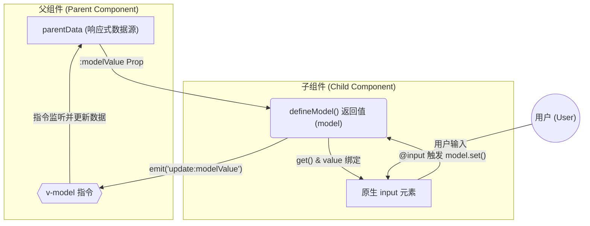

## 数据向下流动 (Props Down)

这个方向描述了数据是如何从父组件传递到子组件并显示的：

1. 数据始于 父组件 中的 parentData 变量
2. 通过父组件模板上的 v-model 指令，parentData 的值被作为 :modelValue prop 传递
3. 数据流入到 子组件 内部，被 defineModel() 返回的 model 变量接收
4. model 变量通过其 get() 方法读取这个 prop 值，并将其绑定到原生 input 元素 的 value 上，最终显示给用户

## 数据向上流动 (Events Up)

这个方向描述了用户的操作是如何反向传递回父组件的：

1. 流程始于 用户 在 input 元素 中输入内容
2. 输入行为触发了 input 上的 @input 事件
3. 这个事件调用了 defineModel() 返回的 model 变量的 set() 方法
4. model 变量的 set() 方法的核心工作是 emit 一个名为 update:modelValue 的事件，并携带上新的输入值
5. 这个 emit 出来的事件被 父组件 上的 v-model 指令所捕获
6. v-model 指令执行更新操作，将接收到的新值赋给 parentData 变量，完成数据闭环
