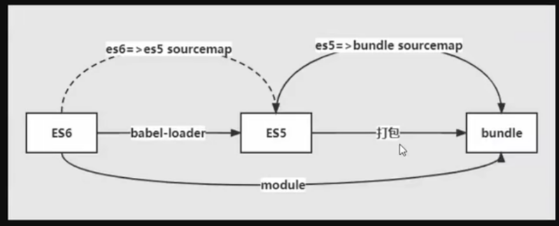

# sourcemap

解决开发代码与实际运行代码不一致，定位到开发代码的技术

## 配置

devtool:

| 关键字     | 描述                                                                |
| ---------- | ------------------------------------------------------------------- |
| source-map | 生成 .map 文件                                                      |
| eval       | 使用 eval 包裹代码，可以缓存，重新构建会更快，开发环境比较推荐      |
| cheap      | 不包含列信息，也不包含 loader 的 sourcemap                          |
| module     | 包含 loader 的 souremap，否则无法定位到源文件                       |
| inline     | 将 sourcemap 信息 作为 DataURI（base64） 嵌入，不单独生成 .map 文件 |

module:

举例说明，es6 的代码转化成 es5 的代码，如果只使用 cheap 的话，由于 babel 生成的 sourcemap 信息没有了，所以只能映射到 es5 的代码；如果加了 module，babel 生成的 sourcemap 信息还在，这样就可以映射到 es6 的代码，更好的与自己写的代码匹配上

## 最佳实践

开发环境：cheap-module-eval-source-map

- 生成 source-map
- 只行映射
- loader 的 sourcemap
- 缓存

生产环境：hidden-source-map
生成 source-map，但是不引入，生成的 source-map 文件可以自己保存，用于后续的线上调试

## 调试

### 本地

### 测试环境
