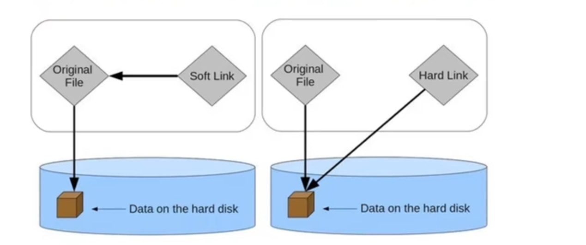
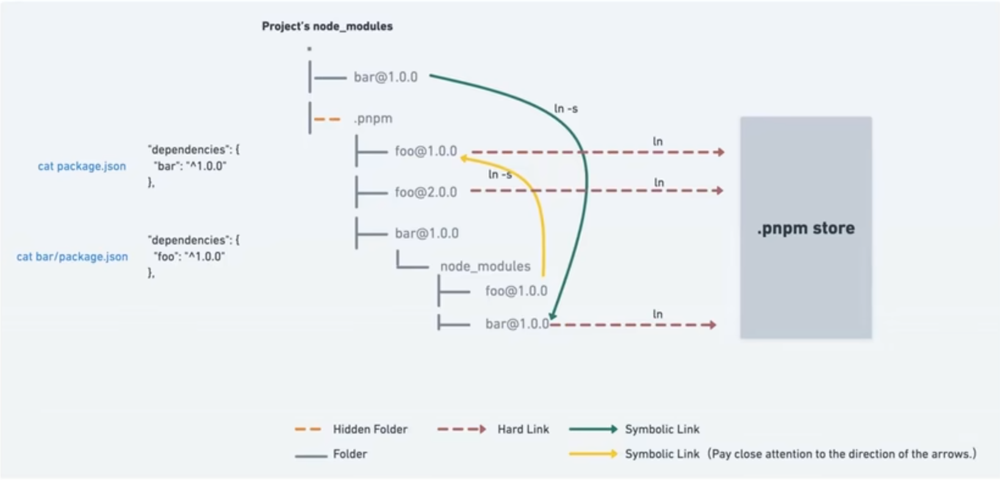

# pnpm
依赖管理工具
一个项目可能会依赖 vue ,vue 本身又会依赖一些其他的包
dependencies Tree

## npm 存在的问题
如何保存依赖的包
npm 对所有的依赖都是拍平放在 node_modules 里面的（依赖树和保存的方式是没有区别的）

Phantom Dependences 幽灵依赖
由于扁平化依赖的存储方式，一个项目依赖了一个包 A，这个包又依赖了包 B，那么在项目里面可以直接访问到 B
1. 删除了依赖 A 之后，依赖 B 不能被访问到了
2. 当依赖 A 升级之后，依赖 B 可能也会升级，导致之前在项目中对 B 的访问，可能会有问题

依赖冲突
项目依赖 A，A 又依赖 B，项目也依赖 B，但是两个 B 的版本是有冲突的

## pnpm 如何解决上面的两个问题
项目里面 package.json 中直接的依赖（的快捷方式） 放在 node_modulse 里面，依赖的依赖（和项目 package.json 的依赖（实际包））放在 node_modules 里的 .pnpm 文件夹下
.pnpm 

## 硬链接和软链接
### 硬链接
多个文件平等的共享一个文件存储单元，删除一个文件的名字后，还可以用其他的名字继续访问该文件
注意：原文件 和 硬链接 本质上是平等的
### 软链接（符号链接）
一类特殊的文件，包含一条以绝对路径或者相对路径的形式向其他的文件或者目录的引用，如果原文件删除了，链接就没有了
电脑的快捷方式

## pnpm 
pnpm 会将依赖包存放在一个统一的位置 store 中（注意实际是存放在一个磁盘中，store 中的内容是硬链接到磁盘中的位置）
当下载包的时候，会在 node_modules 里面创建一个硬链接，链接到 store 中该包 硬链接到的磁盘位置

### pnpm 创建的是非扁平的 node_modules 
npm 创建的 node_modules 是扁平化的，所有的依赖，依赖的依赖，都是拍平了放在同一级的
pnpm 就不同，node_modules 最外层放的是直接依赖，同过软链接链接到 node_modules 的 .pnpm 对应的包，.pnpm 里面存储的是这个项目所有依赖的包的硬链接（.pnpm 中的第一层一般都是硬链接），链接到 store 对应的磁盘位置；依赖包的依赖，会平铺在 .pnpm 中，在 .pnpm 中一个依赖包的依赖是在当前依赖包的 node_modules 里面对应的文件夹建立软链接，链接到 .pnpm 下的对应包

## pnpm 的命令
npm install -> pnpm install 
npm install XXX -> pnpm add XXX
npm uninstall XXX -> pnpm remove XXX
npm run AAA -> pnpm AAA

pnpm store path 查找 store 存放的位置
pnpm store prune 删除不在被项目引用的包
pnpm store status 查看哪些包不在引用